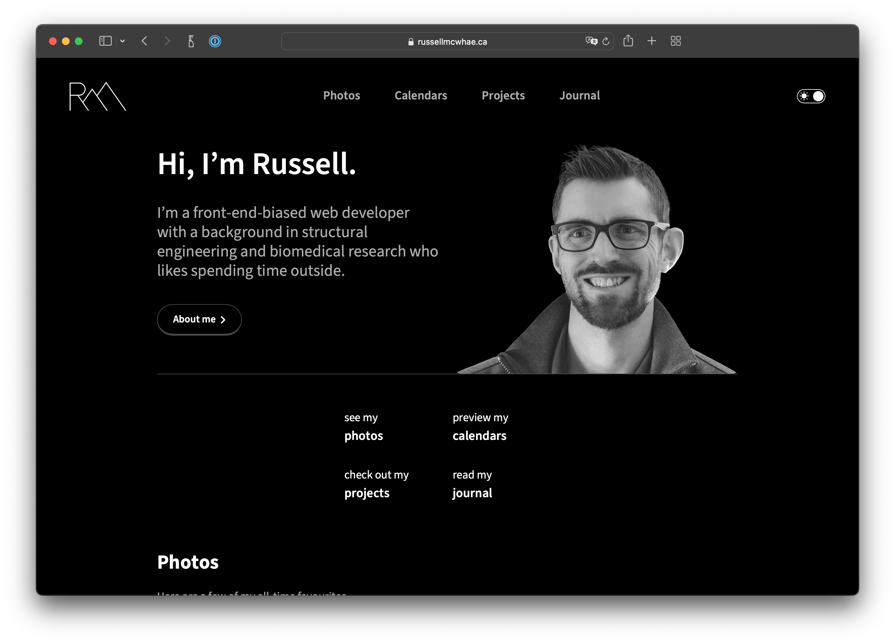

# My Portfolio

This is my portfolio, deployed to https://russellmcwhae.ca, featuring a fully responsive design and a light/dark mode toggle. Feel free to have a look under the hood. Built using [SvelteKit](https://kit.svelte.dev/). For some more detail on this project, see my journal entry, “[That New-Website Look](https://russellmcwhae.ca/journal/new-website/)”.



## Developing

To display images, you will need an [ImageKit](https://imagekit.io) account and to put your credentials in a `.env` file at the project root as in the `.env.template` file. [Portfolio](https://russellmcwhae.ca/photography) and [Event](https://russellmcwhae.ca/events) images are stored on ImageKit’s media library, with a folder structure as follows:

-   portfolio
    -   1st image
    -   2nd image
    -   etc.
-   events
    -   1st-Event-Name_Month-YEAR
        -   1st image
        -   2nd image
        -   etc.
    -   2nd-Event-Name_Month-YEAR
        -   1st image
        -   2nd image
        -   etc.
    -   etc.

For homepage images, add a “featured” tag to four ImageKit images in `/portfolio`. Captions can be added via a `caption` custom metadata field in ImageKit.

Next, install dependencies with `npm install` (or `pnpm install` or `yarn`), then start the development server:

```bash
npm run dev
```

## Deployment

`npm run build` then take the output of `build` and serve it.

## Testing

End-to-end testing is done with Cypress.

While running `npm run dev`, run `npx cypress open` to run tests.
